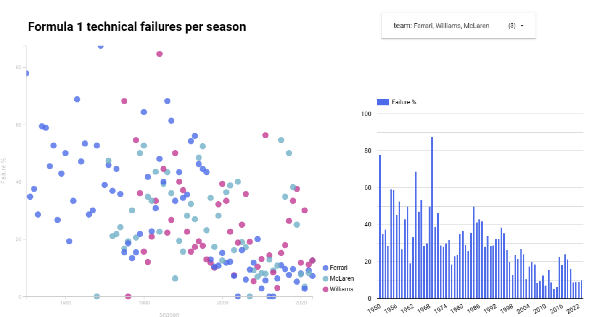
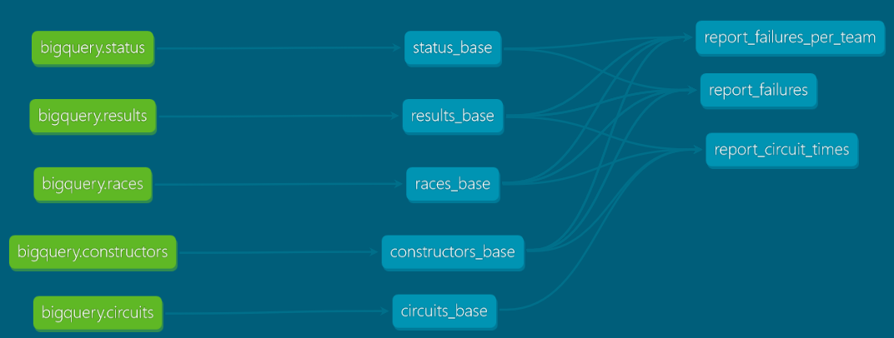
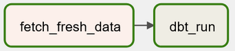

# F1 Data Warehouse Project 
Data pipeline to transform and visualize Formula 1 results.

# Data and Tools
- the project uses motor racing data from [the Ergast database](https://ergast.com/mrd/)
- the data is stored in [BigQuery](https://cloud.google.com/bigquery/)
- data transformation is done using [dbt-core](https://github.com/dbt-labs/dbt-core)
- [Apache Airflow](https://github.com/apache/airflow) is used to automate the pipeline
- data is visualized in [Google Looker studio](https://lookerstudio.google.com)

## How to setup
Check out [this useful guide](https://medium.com/@zzzzhenya/following-dbt-fundamentals-with-dbt-core-9edb5b8f12d6) on how to set up bigquery and dbt cl.

create and activate a virtual enviroment for the project [venv](https://docs.python.org/3/library/venv.html) or [conda](https://conda.io/projects/conda/en/latest/user-guide/tasks/manage-environments.html), install dbt and airflow (note that airflow does not work under Windows): `pip install dbt-bigquery apache-airflow`
### Set up BigQuery
 - [create a BigQuery project](https://cloud.google.com/resource-manager/docs/creating-managing-projects) and a dataset inside
 - create [a service account and obtain the key file](https://holowczak.com/creating-a-service-account-and-key-file-for-google-bigquery/). This key is then used in dbt's profiles.yml and in the python script uploading frech data to BigQuery

 ### Fetch data from the Ergast database
 `ergastdb_to_bigquery/upload_csv_to_bigquery.py` fetches a dump of the database and pushes it to BigQuery

### Set up dbt
- If not cloning this repo, initialize the project: `dbt init`. The command creates the basic folder structure.
- edit `~/.dbt/profiles.yml` (see `profiles_example.yml`): set there your project id, dataset, path to the authentication key file.
- update `dbt_project.yml` if needed
- external datasets are defined in `models/source/bigquery.yml`
- this project analyses technical failure rate per team and the fastest lap time evolution per circuit

 

### Set up Airflow
note: will not work under Windows
 - initialize airflow: `ariflow initdb`
 - in ~/airflow/airflow.cfg make sure that  `dags_folder` points to the airflow subfolder in this project
 - the airflow/dag.py is configured to fetch fresh data and run the transformations once per week:

 
